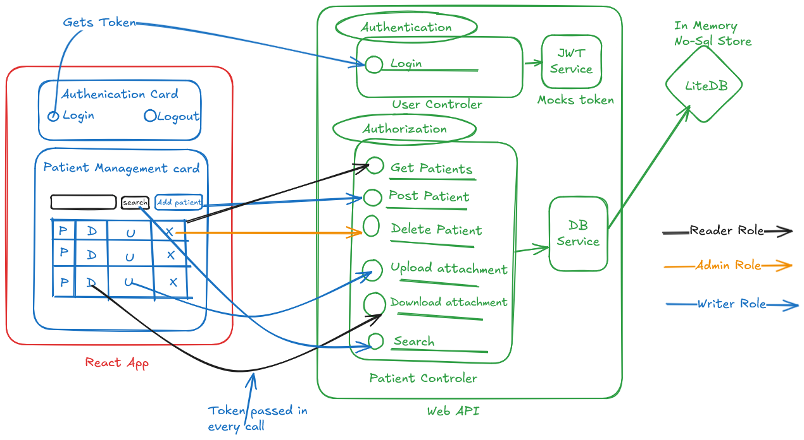

## Patient Management Application

**Logical Diagram:**


 

---
Above diagram represent:

**Components:**

*   **Web API:** Provides the backend services (API endpoints).
    - **User Controller** for user and token management
    - **Patient Controller** for patient demographics and records management
*   **React App:** The user interface built with ReactJS.
    -  **Authentication Card:** Handles login and logout functionality, retrieving tokens.
    - **Patient Management Card:**  The UI Card for managing patient records.
*   **JWT Service:**  Generates a mock JSON Web Tokens, this is to simulate an Identity provider.
*   **LiteDB:** In-memory NoSQL database for storing patient data.
*   **Patient Repository Service:** Interacts with LiteDB to perform CRUD operations.


---

**Flow & Interactions:**

1.  **Token Acquisition:** You can either use swagger's Authorize token to setup the token, or the React App receives a token from the **Authentication Card** (via login), then this token is passed in every subsequent call.

2.  **Authentication Request:**
    *   The React App sends an authentication request to the **User Controller** Login operation in the **Web API**.

3.  **Authorization:** 
    * The **Patient Controller** has the Authorize action filters on each operation, and uses the configured validator to verify the token and performs authorization acording to the roles in the token.

4.  **API Calls & Data Interaction:**
    *   **Web API** support various operations:
        *   `Get Patients`: Retrieves all patients 
        *    `Post Patient`: Creates a new patient record in LiteDB.
        *   `Delete Patient`: Deletes a patient record in LiteDB.
        *   `Upload Attachment`:  Handles file uploads
        *   `Download Attachment`: Handles file downloads 
        *   `Search`: Searches for patients within the database. Its a one text input search supporting multiple fields like name, medical history and attachment types.
        *   `MedicalHistory`: Patient can have multiple historys added via this operation

5. **Data Storage:** The **DB/Repository Service** interacts with the **LiteDB** NoSQL store, managing data based on user roles.

---

**Video Demonstration: Swagger**

To better understand the system's flow and interactions, please watch the following video:

 

**Video Demonstration: React App**

To better understand the system's flow and interactions, please watch the following video:

 


**Key Features/Technologies:**

*   **JWT Authentication:**  Uses JSON Web Tokens for secure authentication and authorization. I have used a mocked token to showcase how I would secure a WebApi. Tokens can be configured to be issued by Azure B2C/AD or OKTA.
*   **LiteDB:** In-memory or local file based NoSQL database for efficient patient record storage. I had used this for the first time. Was fun!
*   **ASP.NET Core** - WebApi are based on AspNetCore MVC. 
*   **Swagger/OpenAPI Specification** 
*   **React App:** Modern JavaScript/Typescript framework I have use to showcase backend API.


**Running the WebAPI**
- open the solution file in Visual Studio
- Set the PatientAPI project as the startup project, and hit play.
- If the React App is running on a different port, update the CORS origin in Program.cs.
- There are unit test with mocked DB Service and JWTService.
- Use the swagger to add,search,delete patients. Also attachment can be added and removed. Also support is there to add Medical History to a patient.

**Running the react app**
- Change to the fd-patient-app directory
``>cd fd-patient-app``

- run npm install
```npm install``

- start the app
``npm start``

- If the API is running on a different port, update variable "API_BASE_URL" in ".\fd-patient-app\src\service.tsx" file.


